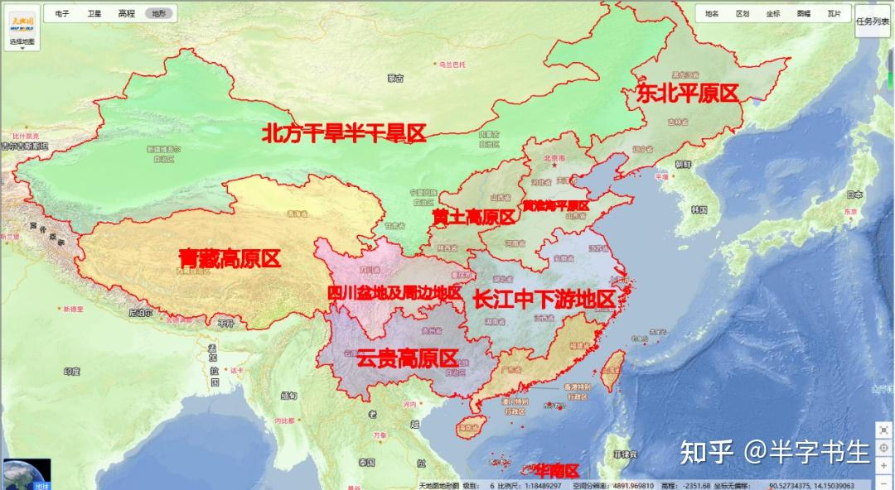

1.东北平原区（Northeast China Plain）：

主要包括东北三省，龙江、吉林、辽宁的大部分地区，是中国最大的平原，土地肥沃，适合机械化大规模耕作，主要种植玉米、大豆、水稻等作物，同时也是中国重要的畜牧业基地。

2.云贵高原区（Yunnan-Guizhou Plateau）：

地形复杂，气候多样，农业生产受地形和气候影响较大，主要种植玉米、水稻、薯类等作物，同时发展茶叶、烟草、中药材等特色农业。

3.北方干旱半干旱区（Northern arid and semiarid region）：

包括内蒙古高原、黄土高原北部以及新疆的大部分地区，气候干旱，降水稀少，但光照充足，适宜发展灌溉农业和畜牧业，如棉花、甜菜、瓜果以及牛、羊等畜牧业生产。

4.华南区（Southern China）：

包括广东、广西、海南、福建南部及云南南部等地区，气候温暖湿润，降水充沛，是中国热带和亚热带经济作物的主要产区，如橡胶、甘蔗、茶叶、热带水果等，同时也是重要的稻米和渔业产区。

5.四川盆地及周边地区（Sichuan Basin and surrounding regions）：

四川盆地气候温暖湿润，土壤肥沃，是中国重要的粮食、油料和生猪生产基地，主要种植水稻、小麦、玉米、油菜等作物。

6.长江中下游地区（Middle-lower Yangtze Plain）：

包括长江中下游的平原和丘陵地带，是中国最富庶的地区之一，农业发达，主要种植水稻、小麦、油菜、棉花等作物，同时渔业、水产养殖业也十分发达。

7.青藏高原区（Qinghai Tibet Plateau）：

海拔高，气候寒冷，农业主要集中在河谷地带，如雅鲁藏布江谷地、湟水谷地等，主要种植青稞、小麦、豌豆等作物，畜牧业以牦牛、藏羊为主。

8.黄土高原区（Loess Plateau）：

位于中国中部，由于长期水土流失，地形破碎，但土层深厚，部分地区适宜种植耐旱作物，如小麦、谷子、马铃薯等，同时也是中国重要的畜牧业基地。

9.黄淮海平原区（Huang-Huai-Hai Plain）：

涵盖黄河下游、淮河、海河平原地区，是中国重要的粮食产区，主要种植小麦、玉米、棉花等作物，农业历史悠久，灌溉条件较好。

